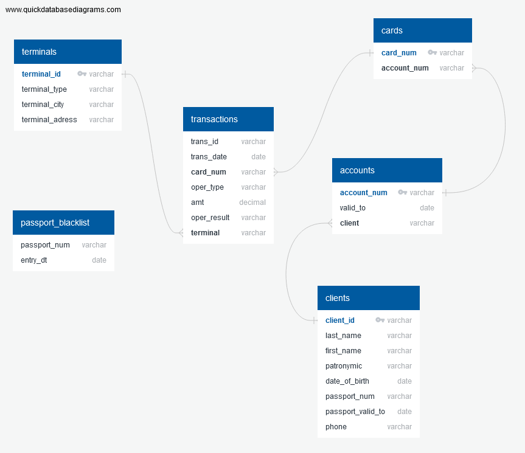
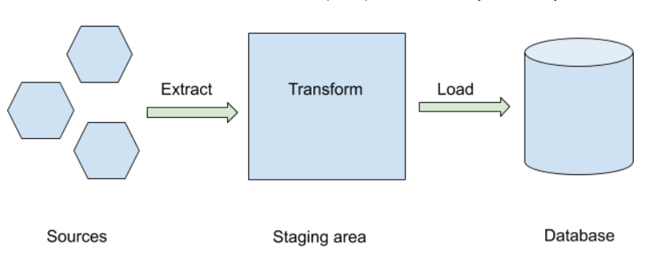
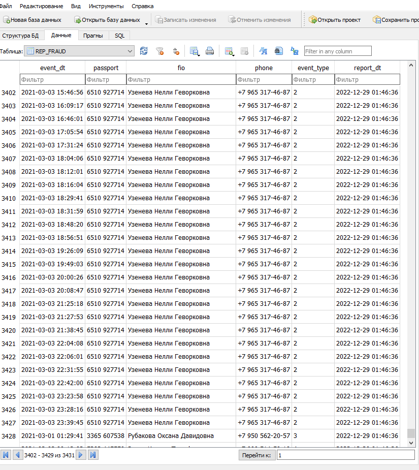

# ETL - Extract, Transform and Load

## Описание проекта

Разработать ETL процесс, получающий ежедневную выгрузку данных (предоставляется за 3 дня), загружающий ее в хранилище данных и ежедневно строящий отчет.

## **Задача:** 

### Построение отчета

По результатам загрузки ежедневно необходимо строить витрину отчетности по мошенническим операциям. Витрина строится накоплением, каждый новый отчет укладывается в эту же таблицу с новым report_dt. 

В витрине содержаться следующие поля:
**event_dt**
Время наступления события. Если событие наступило по результату нескольких действий - указывается время действия, по которому установлен факт мошенничества.

**passport**
Номер паспорта клиента, совершившего мошенническую операцию.

**fio**
ФИО клиента, совершившего мошенническую операцию.

**phone**
Номер телефона клиента, совершившего мошенническую операцию.

**event_type**
Описание типа мошенничества.

**report_dt**
Время построения отчета.

### Признаки мошеннических операций
* Совершение операции при просроченном или заблокированном паспорте.
* Совершение операции при недействующем договоре.
* Совершение операций в разных городах в течение одного часа.
* Попытка подбора суммы. В течение 20 минут проходит более 3х операций со следующим шаблоном - каждая последующая меньше предыдущей, при этом
отклонены все кроме последней. Последняя операция (успешная) в такой цепочке считается мошеннической.

## Схема/архитектура

Данные агружаются в хранилище со следующей структурой (имена сущностей указаны по существу, без особенностей правил наименования):



Архитектура довольно простая: исходные xlsx, txt файлы копируются в локальную папку. Оттуда их берет скрипт на Python и после некоторых трансформаций кладет файлы обратно в локальную папку archive. 

ETL и OLAP:



## Выгрузка данных

Ежедневно информационные системы выгружают следующие файлы:
* Список транзакций за текущий день. Формат - CSV.
* Список терминалов полным срезом. Формат - XLSX.
* Список паспортов, включенных в «черный список» - с накоплением с начала месяца. Формат - XLSX.
Сведения о картах, счетах и клиентах хранятся в ddl_dml.sql.
Предоставляется выгрузка за последние три дня и ее надо обработать.

## Файлы

### Python

* [__init__.py](py_scripts/__init__.py)
* [etl_data_mart.py](py_scripts/etl_data_mart.py)
* [etl_extraction_transformation_data.py](py_scripts/etl_extraction_transformation_data.py)
* [etl_load_db.py](py_scripts/etl_load_db.py)
* [etl_metadata.py](py_scripts/etl_metadata.py)
* [etl_tools.py](py_scripts/etl_tools.py)

### SQL

* [etl_schema.sql](sql_scripts/etl_schema.sql)
* [etl_stg_drop.sql](sql_scripts/etl_stg_drop.sql)
* [ddl_dml.sql](./ddl_dml.sql)

### Cron job every day

* [main.cron](./main.cron)

### TXT, XLSX

* [data.zip](./data.zip)

## Используемые технологии с обоснованием

Данный проект был выполнен локально, со следующим системным окружением:

**Python:** 3.10.5
**Code editor:** Sublime Text3
**SQLite:** DB Browser
**Dependencies:** [req.txt](req.txt)

Поскольку данный проект предполагает обработку данных, которые пополняются, то в качестве решения была предложена обработка по схеме: загрузил->произвел преобразования->выгрузил.

В качестве технологического стека выбраны Python и SQL. Python выбран из-за того, что этот язык считается самым подходящих языков для обработки данных.

## План реализации

### 1. Подготовка системного окружения
Подготовка системного окружения включает в себя установку и настройку следующих инструментов и СУБД: 

**Python:** 3.10.5
**Code editor:** Sublime Text3
**SQLite:** DB Browser
**Dependencies:** [req.txt](req.txt)

### 2. Подготовка и загрузка данных

После создания схемы базы данных выполняется загрузка данных из соответствующих файлов XLSX, TXT, SQL. 

Определяем таблицы фактов и SCD2-формы.

Таблицы SCD2: 
-	terminals, 
-	cards, 
-	accounts, 
-	clients.

Таблицы фактов: 
-	passport_blacklist, 
-	transactions.

### 3. Построение витрины данных

Когда все данные уже собраны в базе данных строится Data Mart для выявления мошеннических операции с помощью оконных функций SQL.

<details>
  <summary>Пример сформированной витрины:</summary>

Таблица REP_FRAUD


</details>

## Результаты разработки и выводы

В наши дни мошенничество встречается повсеместно - будь то небольшой магазин или крупный международный бизнес. Несмотря на появление новых технологий, использующих машинное обучение и искусственный интеллект для выявления фактов мошенничества, многие случаи обнаружения мошенничества по-прежнему требуют глубокого анализа данных с помощью SQL.

Результаты данной реализации и проектирования представлены в следующую структуру:

```bash
.
├── archive                      # Cюда перемещаются отработанные файлы
├── presentation                 # Презентация
├── py_scripts                   # Python скрипты
├── resources                    # Скриншоты
├── sql_scripts                  # SQL скрипты
└── README.md
```

В результате создается автоматизированный pipeline, который извлекает, преобразует и загружает данные. Для этого можно запускать pipeline по расписанию, например, использовать Cron.